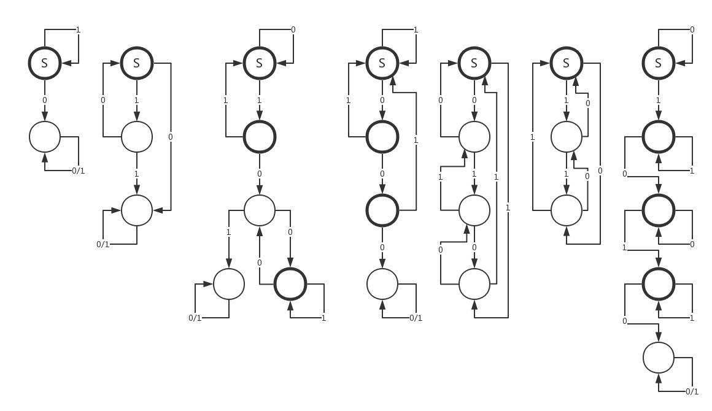

# RNN to DFA

This is a project targeting to extract the minimal DFA given a well-trained RNN model.

## Tomita Grammars

The Tomita grammars is a set of widely used grammars in the problem of grammar inference. It contains 7 different regular grammars defined upon binary alphabet , as shown below.

```
Tomita 1    1*
Tomita 2    (10)*
Tomita 3    all strings without containing odd number of consecutive 0's after odd number of consecutive 1's
Tomita 4    all strings without containing 3 consecutive 0's (000)
Tomita 5    all strings with even numbers of 0's and 1's
Tomita 6    all strings with the difference of numbers of 0's and 1's being 3n
Tomita 7    1*0*1*0*
```

The corresponding minimal DFA's are shown below. The number of states are less than 5. States with thick border represent ACC states, while states with thin border represent REJ states. States with an "S" are starting staes of each DFA. The DFA's are equivalent to Tomita 1 to Tomita 7, from left to right.



The 7 DFA's of the Tomita grammars are defined in ```./tomita/tomita.py```, which are able to classify a given 0/1 sequence (ACC/REJ) and generate 0/1 sequences along with teh ACC/REJ labels. Run ```python3 generator.py``` in the directory ```./tomita/``` to generate the datasets of the Tomita grammars.